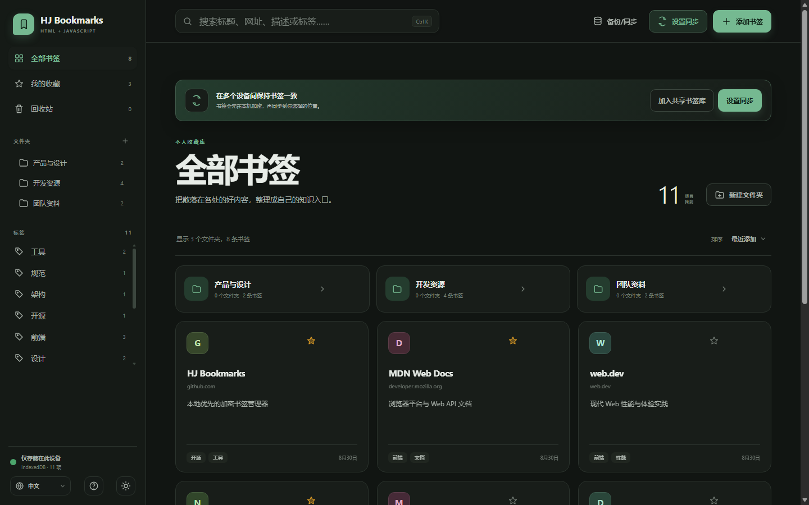

# HJ Bookmarks

[](https://github.com/boatmac/hj-bookmarks/actions/workflows/browser-tests.yml)

一个零构建、零 Node.js 依赖、本地优先的书签管理器，支持加密备份、多设备同步和可信小组共享。项目只使用浏览器原生 HTML、CSS、JavaScript 和 IndexedDB；名称中的 **HJ** 代表 **HTML + JavaScript**。

- **在线使用**：<https://boatmac.github.io/hj-bookmarks/>
- **源代码**：<https://github.com/boatmac/hj-bookmarks>



## 直接运行

双击项目根目录的 `index.html`，使用最新版 Edge、Chrome、Firefox 或 Safari 打开即可。

```text
hj-bookmarks/
├── .github/
│   ├── ISSUE_TEMPLATE/
│   ├── workflows/browser-tests.yml
│   └── dependabot.yml
├── CHANGELOG.md
├── index.html
├── LICENSE
├── SECURITY.md
├── css/
│   └── style.css
├── js/
│   ├── core/          # 配置、存储和通用工具
│   ├── data/          # 导入与导出
│   ├── sync/          # 备份、提供商、加密、合并和冲突
│   ├── ui/            # 页面渲染与书签交互
│   ├── app.js         # 应用启动与事件绑定
│   └── script.js      # 旧版 index.html 的兼容加载器
├── docs/
│   ├── ARCHITECTURE.md
│   ├── DEPLOYMENT.md
│   └── SYNC-DESIGN.md
├── scripts/
│   └── prepare-static-package.mjs
└── tests/
    ├── index.html
    ├── static-checks.mjs
    └── run-browser-tests.mjs
```

不需要执行以下任何操作：

- 不需要安装 Node.js
- 不需要运行 `npm install`
- 不需要启动开发服务器
- 不需要连接互联网

也可以把整个目录复制到任意静态文件服务器、NAS、IIS、Nginx、Apache 或静态网站托管平台。

## 文档与页面帮助

仓库入口文档就是当前根目录的 [`README.md`](README.md)。其他维护文档：

- [`CHANGELOG.md`](CHANGELOG.md)：各发布版本的重要功能、安全和兼容性变化
- [`SECURITY.md`](SECURITY.md)：支持范围、私密漏洞报告入口和脱敏要求
- [`docs/ARCHITECTURE.md`](docs/ARCHITECTURE.md)：模块边界、加载顺序和测试架构
- [`docs/DEPLOYMENT.md`](docs/DEPLOYMENT.md)：GitHub Pages、便携包、Release 和其他静态平台
- [`docs/SYNC-DESIGN.md`](docs/SYNC-DESIGN.md)：同步、加密、凭据和冲突协议

最终用户不需要阅读设计文档。应用侧边栏底部提供 `?` 帮助按钮，页面内说明：

- 快速开始与搜索快捷键
- 文件夹、标签和收藏
- 自动备份、导入导出与回收站
- 云端服务和本地云盘目录同步
- 共享书签库加入、单连接限制与设备来源
- 在线部署、便携包和数据空间迁移
- 冲突处理
- 隐私与加密口令安全

帮助窗口还提供“查看项目 README”“查看部署指南”和“运行浏览器测试”入口，并跟随中文/English 界面语言。

## 功能

- 新增、编辑、删除书签与文件夹
- 多级文件夹及面包屑导航
- 拖拽书签或文件夹调整位置
- 收藏、标签、全文搜索和排序
- 中文 / English 界面切换，首次打开自动跟随浏览器语言
- 深色 / 浅色主题
- IndexedDB 本地持久化，并请求浏览器持久存储保护
- Edge / Chrome 自动备份到用户选择的本地目录
- 明文或 PBKDF2 + AES-GCM 加密的最新备份及 7/30/90 份滚动历史快照
- 备份写后读取验证、健康状态监控与历史快照计数
- 安全更换备份口令，可选重新加密现有历史和紧急快照
- 快照校验、加密解锁、当前数据差异预览、安全合并、选择恢复与完整替换
- 30 天回收站、单项/批量恢复和永久清除
- WebDAV 跨设备双向同步，远端数据使用 PBKDF2 + AES-GCM 加密
- 页面可见时定期检查共享库 ETag/Hash，切回前台或恢复联网时立即检查
- 自定义设备名称，并在冲突中心和回收站显示友好修改来源
- 稳定 UUID、删除墓碑、ETag 条件写入及冲突重试
- 基于同步基线的三方字段级合并与内置冲突中心
- Web Locks 写入互斥与 BroadcastChannel 多标签页自动刷新
- OneDrive、Google Drive、Dropbox、Syncthing 本地目录双向加密同步
- 合并导入 JSON 备份
- 合并导入 Chrome、Edge、Firefox 等浏览器导出的书签 HTML
- 导出完整 JSON 备份
- 导出标准浏览器书签 HTML
- 移动端响应式侧边栏

## 界面语言

首次打开时，应用会读取浏览器首选语言：

- `zh`、`zh-CN`、`zh-TW` 等中文环境默认显示中文
- 其他语言环境默认显示 English

可在侧边栏底部随时切换“中文 / English”。手动选择会保存在当前浏览器中，刷新或重新打开页面后继续生效。

## 自动本地备份

在 Edge 或 Chrome 中打开右上角“备份/同步”菜单，选择“自动本地备份”，然后授权一个本地目录。应用会创建：

```text
选择的备份目录/
├── bookmarks-latest.json                 # 未加密时
├── bookmarks-latest.enc.json             # 开启加密时
├── history/
│   ├── bookmarks-2026-08-30T00-10-00-000Z.json
│   └── bookmarks-2026-08-30T00-15-00-000Z.enc.json
└── emergency/
    ├── bookmarks-before-restore-2026-08-30T01-00-00-000Z.json
    └── bookmarks-before-restore-2026-08-30T01-10-00-000Z.enc.json
```

备份行为：

- 首次选择目录后立即创建完整备份
- 新增、编辑、删除、拖拽或导入后自动备份
- 快速连续修改会合并为一次备份
- 删除或清空前会先尝试保存当前状态
- 可保留最近 7、30 或 90 份历史快照，明文和加密快照合并计算保留数量
- 可选择使用独立备份口令加密最新、历史及恢复前紧急备份
- 最新文件和新历史快照写入后会立即重新读取；加密文件还会在内存中解密并比对完整 payload
- 只有最新与历史文件都验证通过后，界面才显示备份成功并更新最近验证时间
- 可以暂停自动备份，同时保留“立即备份”和“检查备份”能力
- 断开目录不会删除已有备份文件

浏览器重启后可能要求重新确认目录权限。Firefox 和 Safari 不支持自动目录写入时，仍可使用 JSON 手动导出。

自动备份默认仍使用便于迁移的明文 JSON。开启“加密本地备份”后，新文件改用 PBKDF2-SHA-256（250,000 次）派生密钥并以 AES-256-GCM 加密；书签标题、网址、标签、数量和导出时间都不会写入加密信封，历史文件名仍会显示快照时间。成功写入新的最新备份后，应用会移除另一种格式的旧 `bookmarks-latest`，但历史快照不会立即转换，仍按所选保留数量逐步清理，因此同一目录可以同时包含明文和加密历史。

备份口令与同步口令相互独立，默认只存在当前页面内存中。只有明确开启“刷新本标签页时保留口令”后才写入 `sessionStorage`，并且仅在 Navigation Timing 明确为 `reload` 时恢复；普通重新打开、离开后返回或会话恢复都会清除。口令不写入 IndexedDB、localStorage、备份文件或源码，也无法找回。

“加密本地备份”只作用于浏览器自动写入目录的最新、历史和紧急文件。用户主动点击“导出 JSON 备份”下载的迁移文件仍是明文，请自行保管。

自动备份设置中的“备份健康状态”会显示最近验证时间、明文/加密格式及当前历史快照数量。应用至少每 24 小时重新读取一次最新备份；也可以手动点击“检查备份”。文件缺失、内容不一致、格式错误、损坏密文和权限问题都会显示为警告。当前数据尚在等待自动备份时显示为“待更新”，不会把旧文件误报为健康。

### 更换备份口令

口令解锁后，自动备份设置会显示“更换口令”入口。为避免误操作，已确认的原口令输入框保持只读，更换必须在独立窗口完成并再次输入当前口令。

- **只用于今后的备份**：先把当前 latest 安全归档为历史快照，再用新口令创建并验证新的 latest/history；原有历史继续使用旧口令。
- **同时重新加密现有快照**：把可用当前口令解开的 latest、history、emergency 以及明文快照转换为新口令；使用其他更旧口令或已经损坏的文件保持不变。
- 每个转换后的文件都使用不同名称写入并完成读取、解密和 payload 比对，预处理期间不会删除原文件。
- 新口令的当前备份也成功后，才清理已经转换的历史原件；中断时可能暂时看到重复快照，但不会为保持目录整洁而提前删除可恢复数据。
- 更换过程不立即按数量裁剪历史，避免新增安全副本挤掉被跳过的旧快照；下一次常规备份再执行保留策略。
- 结果会报告转换、跳过和未完成清理的数量。存在跳过项时仍需保管对应旧口令。

应用同时调用浏览器持久存储 API，尽量避免 IndexedDB 因存储压力被自动清理；是否授予由浏览器决定，直接打开本地文件时可能返回未授权。它与备份目录是两套独立机制：即使浏览器内部数据保护未获授权，已经写入备份目录的文件也不会受影响。

### 从备份恢复

可以从右上角“备份/同步 → 从备份恢复”、自动备份设置窗口或空数据库首页进入恢复向导。重新选择原备份目录后，应用会逐一验证并列出最新备份、历史快照和恢复前紧急备份，显示时间、大小、书签数、文件夹数及内容预览。选中快照后还会与当前数据比较，分别显示“可新增”“有差异”“相同”和“当前独有”的项目数。

- **安全合并**只补回缺少的文件夹和书签，不覆盖当前已修改的项目；已有 URL 不重复导入，同位置同名文件夹会复用。
- **选择恢复**允许逐项勾选“可新增”或“有差异”的书签和文件夹；恢复后者会明确采用备份版本，缺少的上级文件夹会自动一并恢复。
- **完整替换**将当前书签恢复为快照状态；只有这种方式会移除“当前独有”项目并生成删除记录。
- 恢复向导可同时浏览明文和加密快照；加密文件先显示为锁定状态，输入一次正确口令后即可继续浏览使用相同口令的快照。
- 三种恢复方式执行前都会在 `emergency/` 中写入一份当前数据，最多保留 10 份；当前加密设置或所选快照要求加密时，紧急备份也会加密。
- 错误口令、损坏密文、危险 URL、无效父子层级或版本不兼容的文件都不会写入 IndexedDB。
- 如果其他标签页在预览后修改了数据，向导会刷新比较结果并要求再次确认，不会按过期预览继续执行。
- 恢复记录会使用当前设备的新修改时间，使之后的加密同步能够安全传播恢复结果。
- 浏览器内部数据被清理后，目录文件仍然存在；重新选择目录即可预览和恢复。

## 多标签页协调

同一浏览器配置文件中打开多个应用标签页时：

- Web Locks 确保书签写入和远端同步互斥执行
- 独立备份文件锁串行化多个标签页的自动备份、健康检查和口令更换
- BroadcastChannel 通知其他标签页刷新 IndexedDB 状态
- localStorage `storage` 事件作为消息传输回退
- 一个标签页开始同步后，其他标签页显示“另一标签页正在同步”
- 同步期间其他标签页仍可浏览、搜索和打开链接
- 修改操作会提示稍后重试，避免同步应用结果时覆盖本机变化
- 同步结束或标签页关闭后状态自动释放
- 心跳租约会在异常关闭后自动清理过期同步状态

浏览器不支持 Web Locks 时仍可运行，IndexedDB 事务和标签页广播提供基础保护。

## 恢复中心与回收站

删除书签、文件夹或执行“全部移至回收站”时，应用会在删除墓碑中保存一份可恢复快照，并在侧边栏“回收站”显示。

- 默认保留 30 天
- 支持搜索和按删除时间/标题排序
- 支持单项恢复和永久删除
- 支持多选、全选、批量恢复和批量永久删除
- 回收站工具栏和空状态都可直接进入“历史备份”恢复向导
- 恢复文件夹时同时恢复仍在回收站中的后代项目
- 只恢复子项目但不恢复父文件夹时，项目安全回到根目录
- 恢复会生成新的修改版本，并通过现有同步引擎传播到其他设备
- 永久删除只移除可恢复内容；最小删除墓碑继续保留，避免离线设备重新带回旧数据
- 过期项目启动时自动清除可恢复内容

回收站使用同步 payload v2。启用后应将所有参与同步的设备升级到当前版本；旧版客户端会拒绝 v2 文件，避免静默丢失恢复数据。

回收站与自动历史备份相互独立：回收站用于快速撤销删除，历史快照用于更完整的灾难恢复。

## 本地云盘目录双向同步

在“备份/同步 → 加密同步”中选择：

```text
本地同步目录（OneDrive / Google Drive / Syncthing）
```

然后选择桌面云盘客户端正在同步的本地文件夹，并在所有设备输入相同的加密口令。应用会创建：

```text
选择的目录/
└── devices/
    ├── {device-a}.enc.json
    ├── {device-b}.enc.json
    └── ...
```

每台设备只写自己的 AES-GCM 加密文件，并读取所有设备文件进行合并，因此不会让多台设备争抢同一个 `bookmarks-sync.enc.json`。支持：

- 变更后延迟自动同步
- 页面可见时每 15 秒检查云盘客户端带回的变化
- 页面重新获得焦点时立即检查
- 文件元数据和本地数据均未变化时跳过写入
- 使用现有同步基线、删除墓碑和冲突中心
- 自动识别云盘客户端生成的额外 `.enc.json` 冲突副本
- 目录权限失效时明确提示重新授权

该功能需要支持 File System Access API 的 Edge 或 Chrome，以及已安装并登录的 OneDrive、Google Drive、Dropbox、Syncthing 等桌面客户端。页面关闭时浏览器不执行合并，但桌面客户端仍会继续传输文件；下次打开页面后完成合并。

本地同步目录与自动历史备份职责不同，可以同时使用。建议备份写入独立的 `backups/{device-name}` 子目录，避免与 `devices` 同步文件混放。

## 同步设置向导

首次打开“加密同步”时会进入五步向导。产品界面只要求选择数据位置：

- **远端同步**：填写服务提供的地址、用户名和密码；应用在底层自动选择兼容的连接适配器
- **本地同步目录**：选择由桌面同步软件管理的文件夹

向导随后确认加密口令、自动同步和刷新凭据偏好，并在完成前执行一次真实的读取、写入和加密合并验证。Koofr、标准 WebDAV 及其浏览器兼容差异不会作为用户需要选择的同步类型；服务识别与协议适配封装在远端适配层中。无论是否已有配置，都可以从右上角“备份/同步 → 同步设置向导”直接重新进入；同步设置窗口底部也保留了向导入口。

## 云端加密同步

首次使用时可以点击首页引导卡片中的“设置同步”，也可以在右上角“备份/同步”菜单中选择“加密同步”；随后在向导中选择“远端同步”，填写：

- WebDAV 目录或完整文件地址
- 用户名
- 密码或应用密码
- 至少 8 个字符的加密口令

目录地址会自动使用固定文件名：

```text
https://dav.example.com/bookmarks/
└── bookmarks-sync.enc.json
```

也可以直接填写完整的 `.json` 文件地址。默认开启“自动创建同步目录”：首次同步时会创建同步文件所在的最后一级目录；更上层路径仍需提前存在。该选项可以在同步设置中关闭。

### Koofr

应用会自动识别 `https://app.koofr.net/dav/...` 地址，并透明改用 Koofr 官方 REST API。该 API 明确允许本地 `file://` 页面通过 CORS 访问，因此不需要反向代理，也不会向不支持浏览器跨域的 Koofr WebDAV 端点发送请求。

可直接继续填写 Koofr WebDAV 地址，例如：

```text
https://app.koofr.net/dav/Koofr/Example-Bookmarks/
```

用户名使用 Koofr 登录邮箱，密码使用 Koofr 生成的应用密码。应用会自动连接对应存储空间、创建最后一级目录并上传加密同步文件。首次成功连接后会记住必要的非敏感存储信息，后续刷新时直接访问同步文件。普通 WebDAV 地址会自动使用标准协议。刷新后的首次自动同步会稍作延迟；遇到临时网络超时会释放写锁并渐进重试，不会立即标记为永久失败。手动同步仍会直接显示结果，由用户决定是否再次尝试。

右上角“备份/同步”旁提供同步快捷按钮：正常时可立即同步，等待自动重试时可立即重试，缺少凭据时打开解锁设置，存在冲突时直接进入冲突中心；移动端显示为带有无障碍标签的图标按钮。

同步特性：

- 远端只保存 PBKDF2 + AES-GCM 加密密文
- 地址、用户名和自动同步偏好保存在本机
- WebDAV 密码及加密口令默认只保留在当前页面内存中
- 可选择“刷新本标签页时保留凭据”，使用 `sessionStorage` 跨刷新恢复
- 取消选项、离开页面、关闭后重新打开或移除同步配置时清除会话凭据
- 首次同步可自动创建最后一级 WebDAV 目录及远端文件
- 不会递归创建更上层目录，避免误建路径
- 后续同步会合并本机和远端数据
- 开启自动同步并完成解锁后，远端模式每 60 秒检查一次共享库版本
- 页面切回前台、窗口重新获得焦点或网络恢复时会提前检查
- 标准 WebDAV 优先使用 ETag 条件 GET；Koofr 只读取文件 Hash 和修改时间
- 远端未变化时不解密、不合并也不写入；发现变化后才运行完整同步
- 多标签页使用独立远端检查锁和共享时间戳，避免重复高频请求
- 使用稳定 UUID 识别同一条书签
- 删除操作通过墓碑记录同步到其他设备
- 相同记录发生冲突时按 `updatedAt` 和设备 ID 确定版本
- 使用 ETag / `If-Match` 防止并发覆盖，冲突时自动重新读取并重试
- 参与同步的设备应保持系统时间准确
- 手动同步成功后，可在当前页面会话中启用自动上传与共享库更新检查

同一浏览器配置文件中的多个标签页会通过 Web Locks 串行化保存与同步，并通过 BroadcastChannel 通知其他页面刷新数据；同步开始前还会重新读取 IndexedDB。

加密口令不会上传，也无法找回。所有设备必须使用完全相同的口令；遗失口令将无法解密远端文件。

“刷新本标签页时保留凭据”默认关闭。开启后，密码和加密口令只写入该标签页的 `sessionStorage`。应用还会检查 Navigation Timing：只有本次导航明确属于 `reload` 才恢复；普通重新打开、地址栏重新进入、离开后返回或浏览器会话恢复都会先清除。该选项不会把凭据写入 IndexedDB、localStorage、源码或远端文件。

### 连接兼容性

Koofr 地址会自动使用适合浏览器访问的连接方式。其他标准 WebDAV 服务必须允许网页访问；如果服务不兼容，应用会给出连接错误，请联系对应服务管理员。

同步过程中会显示当前阶段，并允许取消。刷新后的后台连接不会冻结页面；为了避免合并期间覆盖数据，修改操作会短暂暂停，完成或取消后立即恢复。自动同步遇到暂时性网络问题时显示“等待自动重试”，本机数据不受影响；用户界面不会暴露服务内部 API 路径或存储标识。

协议、CORS、加密格式、凭据边界及冲突算法详见 [`docs/SYNC-DESIGN.md`](docs/SYNC-DESIGN.md)。

## 可信小组共享书签库

家庭、工作室或小型团队可以把静态部署的 HJ Bookmarks 作为同一个加密共享书签库入口。每台设备仍使用独立 IndexedDB，但配置同一个 WebDAV 同步文件和相同加密口令；完成首次同步后，自动同步会上传本机变化，并在页面可见时定期发现其他成员的更新。

当前是平等协作模型：所有获得 WebDAV 目录权限和加密口令的成员都能查看、编辑、移动和删除全部共享书签。每台设备可以设置“设计组笔记本”“客厅电脑”等名称；名称随加密 payload 同步，用于冲突和删除来源显示，但不代表成员身份或权限。建议 WebDAV 服务为每位成员提供独立应用密码和同一共享目录权限，以便单独撤销未来访问。已经下载到成员设备的数据无法远程收回。

静态网站地址本身不包含共享书签或凭据，普通访客只会获得自己的空数据库。团队库与私人书签不应混在同一个浏览器 Origin；需要同时使用时，可采用不同子域名或浏览器配置文件。项目保持纯前端，不提供中央账号、角色、审批或服务端审计。

创建第一份共享库时，由组织者使用普通“设置向导”配置远端并完成首次同步。其他成员使用“加入共享书签库”入口：向导固定使用远端 WebDAV，要求现有同步文件存在，默认开启自动上传和共享库更新检查，并引导填写成员凭据、统一加密口令及设备名称。如果当前浏览器已有本机书签，最后一步会明确显示数量并要求确认，避免把私人书签意外上传到共享库。

加入向导会执行真实读取、AES-GCM 解密、三方合并和 ETag/Hash 条件写入；失败时恢复原同步配置。密码与加密口令仍只在内存中，除非成员明确选择仅在刷新本标签页时保留。

当前版本一次只支持一个同步位置。连接成功后，“加入共享书签库”和设置向导入口会隐藏，同步方式、远端地址和用户名变为只读，避免把“更换 WebDAV 地址”误解成安全的书签库切换。如需使用另一套共享库，优先采用独立子域名或浏览器配置文件；确需重置时先移除当前同步配置，本机书签不会自动删除，之后加入其他库仍需明确确认是否参与合并。

## 冲突处理

每次成功同步后，应用会在 IndexedDB 中保存该端点的同步基线。后续同步使用：

```text
上次同步基线 + 本机当前状态 + 远端当前状态
```

进行三方字段级合并，而不是只按整个书签的修改时间覆盖。

可以自动处理：

- 双方修改了不同字段
- 一端修改、另一端未修改
- 标签集合的添加和删除
- 内容编辑与目录移动同时发生
- 两端得到相同最终内容

需要用户确认时：

- 双方为标题、URL、描述或上级目录设置了不同值
- 一端删除、另一端编辑了同一项目

应用会停止本次远端覆盖，将双方版本和待处理状态持久化，并显示“冲突中心”。“备份/同步”菜单中始终提供冲突中心入口，并显示“暂无待处理冲突”或具体数量；同步设置会显示冲突基线是否已建立。用户可以在 UI 中：

- 保留本机版本
- 保留远端版本
- 逐字段选择并应用合并
- 对书签保留两个副本
- 确认删除或恢复编辑版本
- 稍后处理，刷新页面后冲突仍然保留

检测到冲突时，其他可安全自动合并的远端变化会先应用到本机；同步前会尝试创建本地快照。所有冲突解决后，应用会以用户确认的结果重新同步。日常处理不需要导出或手工比较 JSON。

升级后的第一次成功同步用于建立基线；从第二次同步开始可以进行完整三方冲突检测。

## 数据与隐私

默认情况下，所有书签只保存在当前浏览器的 IndexedDB 中，没有遥测或第三方网络请求。自动备份只会写入用户明确选择的本地目录；只有用户配置并主动解锁 WebDAV 后，应用才会访问对应的同步地址。

需要注意：

- 不同浏览器、浏览器配置文件及站点地址拥有独立的数据空间。
- 无痕 / 隐私窗口中的数据可能在窗口关闭后消失。
- 清除浏览器站点数据会删除本地书签。
- 移动项目目录、切换浏览器或重装系统前，建议先导出 JSON 备份。

## 导入与恢复

页面右上角“备份/同步”菜单中的“导入”同时支持：

- 本应用导出的 `.json`
- 浏览器导出的 `.html` / `.htm`

导入采用安全的“合并”策略：

- 不会先清空现有数据
- 相同 URL 的书签会自动跳过
- 文件夹层级会尽量保留
- 不支持的危险 URL 协议会被跳过

如果需要完整替换，可先导出当前数据，然后使用“备份/同步”菜单中的“清空全部数据”，再导入备份。

## 安全设计

- 用户数据使用 DOM `textContent` 渲染，不拼接到 `innerHTML`
- 拒绝 `javascript:`、`data:` 等危险链接协议
- 文件夹不能移动到自身或子文件夹
- 导入及恢复文件会先完成解析、解密和校验，再写入 IndexedDB
- 加密备份使用独立随机 salt、96-bit IV 和 AES-256-GCM 完整性校验
- 一次导入或恢复使用原子 IndexedDB 事务，失败时不会留下半套数据

## 浏览器存储兼容

应用延续旧版本数据库名称 `BookmarkDB_v3`，会自动升级数据库结构并读取已有数据。

如果某个浏览器安全策略禁止 `file://` 页面使用 IndexedDB，可以把这些静态文件放到任意静态 Web 服务中；应用本身仍然不需要 Node.js。

## 浏览器测试

测试套件同样不需要 Node.js。直接打开：

```text
tests/index.html
```

测试使用动态生成的独立 IndexedDB，结束后自动删除，不会读取或修改正式书签数据库。当前覆盖：

- 标签、URL 和同步地址规范化
- WebDAV / Koofr 地址识别
- WebDAV 条件版本探测、Koofr Hash 探测和远端变化触发
- 多标签页远端检查锁与定时调度
- 设备名称加密同步、更新时间合并和旧 payload 兼容
- JSON 与浏览器 HTML 导入
- 明文/加密混合备份目录扫描、损坏密文校验和恢复前紧急快照
- 备份写后重新读取、payload 比对、损坏检测和健康元数据
- 备份口令更换、latest 安全归档、历史重加密和旧口令快照保留
- 快照差异分类、安全合并和选择恢复计划
- 同步及备份的 AES-GCM 加密、解密、明文泄漏检查和错误口令
- 同步 payload v1 → v2 兼容
- 回收站快照、恢复、永久清除和过期清理
- Web Locks 并发写入串行化
- 不同字段自动合并
- 标签三方合并
- 同字段冲突检测
- 删除与编辑冲突
- IndexedDB schema、墓碑、基线和冲突存储

模块仍使用有序的普通 `<script defer>`，不使用 ES Module，因此继续兼容直接从 `file://` 打开。`js/script.js` 只作为旧缓存页面的轻量兼容加载器。

### GitHub Actions、在线发布与便携包

仓库包含 [`.github/workflows/browser-tests.yml`](.github/workflows/browser-tests.yml)。推送到 GitHub 或创建 Pull Request 时会自动：

1. 使用 `node --check` 检查所有 JavaScript 语法；
2. 检查 HTML ID、DOM 缓存、中英文词典、本地资源引用和缓存版本；
3. 使用 Headless Chrome 直接打开 `tests/index.html`；
4. 读取 `window.__TEST_RESULTS__`，任何测试失败都会让工作流失败；
5. 生成 `{repository-name}-portable.zip` 和 SHA-256 校验文件；
6. `main` 分支通过后部署到 GitHub Pages；
7. 推送 `v*` 标签时创建 GitHub Release 并附加便携包。

每次测试生成的 Actions Artifact 保留 14 天，适合开发验证；Release 附件适合最终用户长期下载。包名从 GitHub 当前仓库名动态生成，因此未来重命名仓库不需要修改工作流。用户解压 ZIP 后直接双击 `index.html` 即可使用。

CI 脚本不安装 npm 包，也不参与应用运行或代码转译。最终用户仍然不需要 Node.js。维护者若已安装 Node.js 22 和 Edge/Chrome，可以在本地选择运行：

```bash
node tests/static-checks.mjs
node tests/run-browser-tests.mjs
node scripts/prepare-static-package.mjs dist/site
```

浏览器测试页本身仍可直接双击运行。首次启用 Pages、创建版本标签、校验下载包以及 Cloudflare、Netlify、Azure 的部署说明详见 [`docs/DEPLOYMENT.md`](docs/DEPLOYMENT.md)。

## 问题与安全报告

- 普通缺陷和功能建议请使用仓库的结构化 [Issue 模板](https://github.com/boatmac/hj-bookmarks/issues/new/choose)。
- 尚未修复的安全漏洞请使用 [Private vulnerability reporting](https://github.com/boatmac/hj-bookmarks/security/advisories/new)，不要公开提交密码、令牌、加密口令或私人书签。

完整要求见 [`SECURITY.md`](SECURITY.md)。

## 项目状态

HJ Bookmarks 已通过本地 `file://`、GitHub Actions、便携包、GitHub Pages 和真实 WebDAV 同步验收，当前进入 `v1.0.0-rc.1` 发布候选阶段。内部数据库名称、Storage Key、备份格式和同步协议继续保留原有兼容标识，品牌更新不会影响已有数据。

## 许可证

本项目采用 [MIT License](LICENSE)，版权所有 © 2026 [boatmac](https://github.com/boatmac)。
